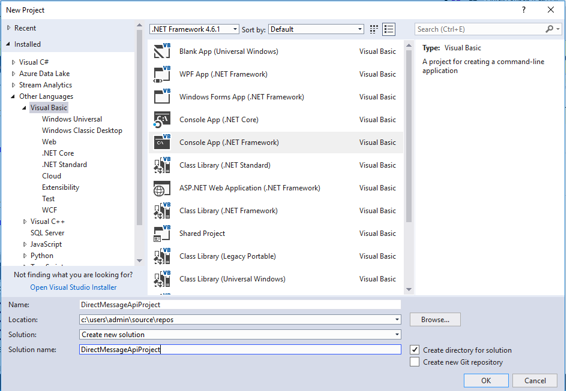
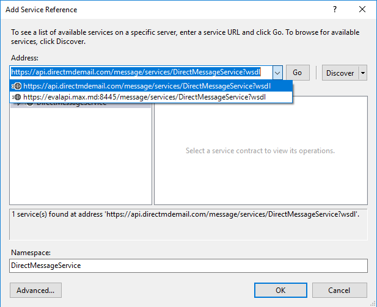
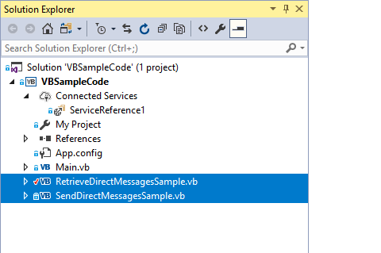

<h1>DirectMessage API VB Sample</h1>
<h3>API V3: https://directapi.max.md:8445/message/</h3>
<h3>Production Endpoint URL: https://api.directmdemail.com/message/services/DirectMessageService?wsdl</h3>
<h3>Evaluation Endpoint URL: https://evalapi.max.md:8445/message/services/DirectMessageService?wsdl</h3>
<strong>To run the sample project, you need to uncomment functions you want to use on [Main.vb](./VBSampleCode/VBSampleCode/Main.vb) and [SendDirectMessagesSample.vb](./VBSampleCode/VBSampleCode/SendDirectMessagesSample.vb) and set correct username and password.</strong>
 
<h4>To Create a new project:</h4>
1.	Create a new .NET Framework project 

2.	Add our service reference in your project 
 

3.	Copy [RetrieveDirectMessagesSample.vb](./VBSampleCode/VBSampleCode/RetrieveDirectMessagesSample.vb) and [SendDirectMessagesSample.vb](./VBSampleCode/VBSampleCode/SendDirectMessagesSample.vb) to your project 
 
See [Main.vb](./VBSampleCode/VBSampleCode/Main.vb) how to use these two classes, and that’s it! 
